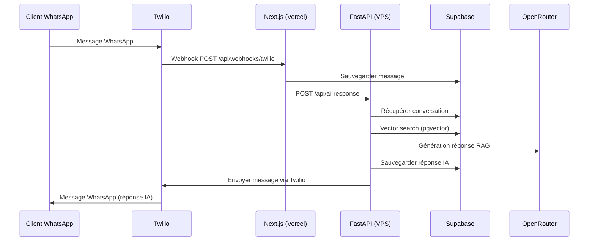
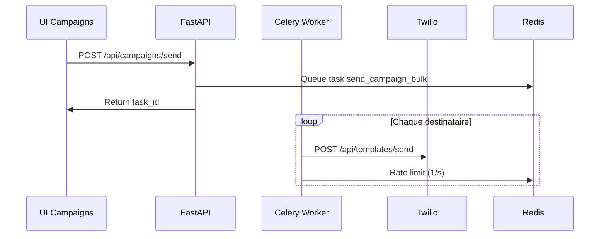

# Architecture Bobotcho — Refactor VPS 2026-02-08

## Résumé

Migration de l'architecture n8n vers un backend FastAPI sur VPS Hostinger pour remplacer n8n, ajouter les templates Twilio Content API, et supporter les campagnes bulk + automations.

---

## Architecture Avant vs Après

### Avant (n8n)
```
Next.js (Vercel) → n8n (VPS Hostinger) → Supabase + Twilio SMS
```

### Après (FastAPI)
```
Next.js (Vercel) → FastAPI (VPS Hostinger) → Supabase + Twilio Content API
                                      ↓
                                  Celery + Redis (campagnes + automations)
```

---

## Stack Technique

| Composant | Technologie | Rôle |
|-----------|-------------|------|
| **Frontend** | Next.js (Vercel) | UI + webhook Twilio |
| **Backend** | FastAPI (Docker) | RAG + Templates + API |
| **RAG** | LangChain + OpenRouter + Supabase pgvector | IA contextualisée |
| **Twilio** | SDK Python (Content API) | Templates WhatsApp |
| **Queue** | Celery + Redis | Campagnes bulk + automations |
| **Database** | Supabase (PostgreSQL + pgvector) | Conversations + templates + vector store |
| **Deployment** | Docker Compose | 4 containers sur VPS Hostinger |

---

## Services Docker (VPS Hostinger)

```yaml
services:
  api:          # FastAPI (port 8000)
  redis:        # Queue + cache (port 6379)
  celery-worker: # Tâches async (campagnes)
  celery-beat:   # Cron automations
```

**URL publique** : `https://srv1014720.hstgr.cloud:8000`

---

## Endpoints FastAPI

| Méthode | Endpoint | Description |
|---------|----------|-------------|
| `GET` | `/health` | Health check |
| `POST` | `/api/ai-response` | RAG (remplace n8n) |
| `GET` | `/api/templates` | Lister templates |
| `POST` | `/api/templates` | Créer template + soumettre à Meta |
| `POST` | `/api/templates/send` | Envoyer template via Content SID |
| `POST` | `/api/campaigns/send` | Lancer campagne bulk (Celery) |
| `POST` | `/api/messages/send` | Envoyer message freeform |

**Auth** : Header `X-API-Key` avec `BACKEND_API_KEY`

---

## Workflow Messages

### 1. Message Entrant (WhatsApp → Next.js → FastAPI)



### 2. Campagne Bulk (Next.js → FastAPI → Celery)



---

## Templates Twilio Content API

### Templates déployés (7)

| Nom | Content SID | Statut |
|-----|-------------|--------|
| `bobotcho_bienvenue_optin` | `HX...` | ✅ approved |
| `bobotcho_paiement_reussi` | `HX...` | ✅ approved |
| `bobotcho_rguide_installation` | `HX...` | ✅ approved |
| `bobotcho_livraison_imminente` | `HX...` | ✅ approved |
| `bobotcho_avis_post_achat` | `HX...` | ✅ approved |
| `bobotcho_avis_post_achat_v2` | `HX...` | ✅ approved |
| `bobotcho_panier_abandonne_v2` | `HX...` | ✅ approved |

### Flux création template

1. **POST /api/templates** → Créer sur Twilio Content API
2. **Auto-submit** → Soumettre à Meta pour approbation
3. **Cron** → Vérifier statut approbation toutes les heures
4. **Mise à jour** → Sync statut dans Supabase

---

## RAG (Retrieval-Augmented Generation)

### Configuration

- **Embeddings** : OpenAI `text-embedding-3-small`
- **Vector Store** : Supabase pgvector (`knowledge_base` table)
- **LLM** : OpenRouter `openai/gpt-4o-mini`
- **Top K** : 5 documents pertinents
- **Mémoire** : 10 derniers messages de conversation

### Prompt System

```
Tu es le 'Concierge Bobotcho', assistant IA d'élite pour une marque ivoirienne.
Ton ton est 'Abidjan Premium' : poli, chaleureux, expert et utilisant le vouvoiement.

RÈGLES:
1. Sois bref, élégant et mentionne les quartiers d'Abidjan
2. Priorise toujours le bundle avec installation (70 000 FCFA)
3. Utilise TOUJOURS le vouvoiement
4. Réponds en français

CONTEXTE: {context}
HISTORIQUE: {chat_history}
```

---

## Automations (Celery Beat)

### Triggers supportés

| Trigger | Audience | Template typique |
|---------|----------|------------------|
| `new_customer` | `new_7d` | Bienvenue Opt-in |
| `inactive_30d` | `inactive_30d` | Réactivation |
| `cart_abandoned` | `active_30d` | Panier Abandonné V2 |
| `order_created` | `all` | Paiement Réussi |
| `post_purchase` | `active_30d` | Avis Post-Achat |

### Schedule

- **Check automations** : Toutes les 5 minutes
- **Check template approvals** : Toutes les heures

---

## Déploiement VPS Hostinger

### Commandes déploiement

```bash
# Clone repo
git clone https://github.com/mosafly/Whatsappagent.git /opt/bobotcho
cd /opt/bobotcho/backend

# Config .env (avec vraies clés API)
cat > .env << 'EOF'
SUPABASE_URL=https://hoocwfwgdcxuseksjeho.supabase.co
SUPABASE_SERVICE_ROLE_KEY=eyJ...
OPENROUTER_API_KEY=sk-or-v1-...
OPENAI_API_KEY=sk-proj-...
TWILIO_ACCOUNT_SID=ACf456...
TWILIO_AUTH_TOKEN=8d0cbb...
TWILIO_WHATSAPP_NUMBER=+14155238886
REDIS_URL=redis://redis:6379/0
API_SECRET_KEY=<secret-32-chars>
CORS_ORIGINS=https://whatsappagent-five.vercel.app
EOF

# Lancer services
docker compose up -d --build

# Vérifier
docker compose ps
curl http://localhost:8000/health
```

### Services monitoring

```bash
# Logs en temps réel
docker compose logs -f api
docker compose logs -f celery-worker
docker compose logs -f celery-beat

# Stats Redis
docker exec bobotcho-redis redis-cli info
```

---

## Migration n8n → FastAPI

### Webhook Next.js (feature flag)

```typescript
const BACKEND_URL = process.env.BACKEND_URL; // Activer pour FastAPI

if (BACKEND_URL) {
  // FastAPI backend
  const backendRes = await fetch(`${BACKEND_URL}/api/ai-response`, {
    headers: { 'X-API-Key': process.env.BACKEND_API_KEY },
    body: JSON.stringify({ Body, From, conversationId, messageId }),
  });
} else {
  // Fallback n8n (comportement actuel)
  const n8nRes = await fetch(process.env.N8N_WEBHOOK_URL!, { ... });
}
```

### Variables Vercel

| Variable | Valeur | Description |
|----------|--------|-------------|
| `BACKEND_URL` | `https://srv1014720.hstgr.cloud:8000` | URL FastAPI |
| `BACKEND_API_KEY` | `<secret>` | Auth inter-service |

---

## Sécurité

| Protection | Implémentation |
|------------|----------------|
| **Auth API** | Header `X-API-Key` entre Next.js et FastAPI |
| **CORS** | Restreint à Vercel + localhost |
| **Rate limiting** | 1 message/seconde (Twilio) |
| **Secrets** | `.env` ignoré par `.gitignore` |
| **HTTPS** | Vercel + VPS (nginx recommended) |

---

## Monitoring & Logs

### FastAPI logs
```bash
docker compose logs api | grep "RAG response"
docker compose logs api | grep "Twilio"
```

### Celery tasks
```bash
docker exec bobotcho-celery-worker celery -A app.tasks.celery_app inspect active
```

### Supabase monitoring
- `ai_logs` table → latences, erreurs RAG
- `messages` table → volume conversations
- `campaigns` table → stats envois

---

## Prochaines Évolutions

1. **Reverse proxy nginx** → HTTPS sur VPS
2. **Monitoring Grafana** → Dashboards RAG + campagnes
3. **Templates dynamiques** | Génération IA de templates
4. **Analytics avancés** | Taux conversion par template
5. **Multi-lingue** | Support anglais/anglais pour Côte d'Ivoire

---

## Déploiement Production Checklist

- [ ] VPS Docker installé
- [ ] Repo cloné en `/opt/bobotcho`
- [ ] `.env` configuré avec vraies clés
- [ ] `API_SECRET_KEY` généré et partagé avec Vercel
- [ ] `BACKEND_URL` activé sur Vercel
- [ ] Test webhook Twilio → FastAPI
- [ ] Test template envoi
- [ ] Test campagne bulk
- [ ] Monitoring logs configuré

---

*Document mis à jour le 8 février 2026 — Architecture VPS refactor complète*
